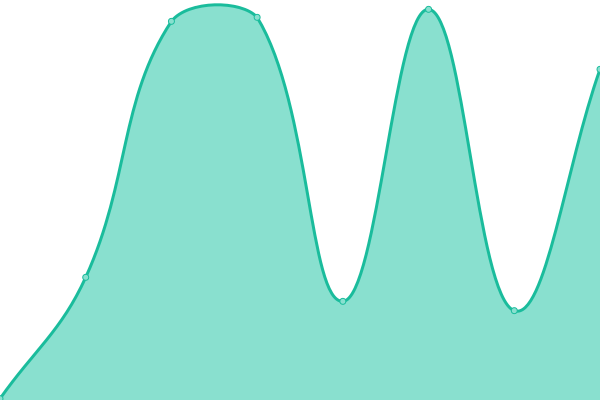
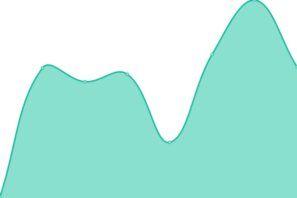
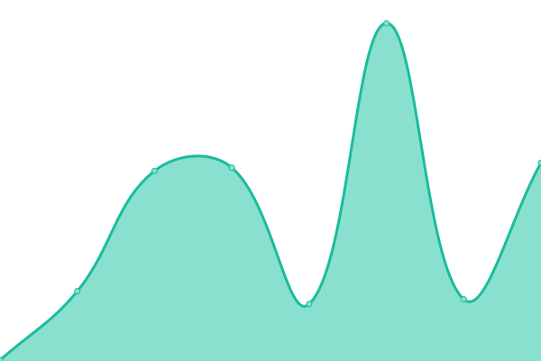
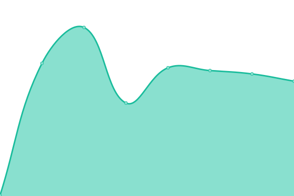

# [📈 Live Status](https://status.ak1ra.xyz): <!--live status--> **🟩 All systems operational**

This repository contains the open-source uptime monitor and status page for [ak1ra-lab](https://status.ak1ra.xyz), powered by [Upptime](https://github.com/upptime/upptime).

With [Upptime](https://upptime.js.org), you can get your own unlimited and free uptime monitor and status page, powered entirely by a GitHub repository. We use [Issues](https://github.com/ak1ra-lab/status/issues) as incident reports, [Actions](https://github.com/ak1ra-lab/status/actions) as uptime monitors, and [Pages](https://status.ak1ra.xyz) for the status page.

<!--start: status pages-->
<!-- This summary is generated by Upptime (https://github.com/upptime/upptime) -->
<!-- Do not edit this manually, your changes will be overwritten -->
<!-- prettier-ignore -->
| URL | Status | History | Response Time | Uptime |
| --- | ------ | ------- | ------------- | ------ |
|  [Homepage](https://ak1ra.xyz) | 🟩 Up | [homepage.yml](https://github.com/ak1ra-lab/status/commits/HEAD/history/homepage.yml) | 

 607ms
     
 | 

<a href="https://status.ak1ra.xyz/history/homepage">99.87%</a>
    

|  [Images](https://i.ak1ra.xyz) | 🟩 Up | [images.yml](https://github.com/ak1ra-lab/status/commits/HEAD/history/images.yml) | 

 152ms
     
 | 

<a href="https://status.ak1ra.xyz/history/images">100.00%</a>
    

|  [GitHub Proxy](https://gh.ak1ra.xyz) | 🟩 Up | [git-hub-proxy.yml](https://github.com/ak1ra-lab/status/commits/HEAD/history/git-hub-proxy.yml) | 

 146ms
     
 | 

<a href="https://status.ak1ra.xyz/history/git-hub-proxy">100.00%</a>
    

|  [Wikipedia Proxy](https://wikipedia.ak1ra.xyz/www/) | 🟩 Up | [wikipedia-proxy.yml](https://github.com/ak1ra-lab/status/commits/HEAD/history/wikipedia-proxy.yml) | 

 236ms
     
 | 

<a href="https://status.ak1ra.xyz/history/wikipedia-proxy">100.00%</a>
    

|  [Downloads](https://dl.ak1ra.xyz) | 🟩 Up | [downloads.yml](https://github.com/ak1ra-lab/status/commits/HEAD/history/downloads.yml) | 

 216ms
     
 | 

<a href="https://status.ak1ra.xyz/history/downloads">100.00%</a>
    

|  [Subconverter](https://sub.ak1ra.xyz/version) | 🟩 Up | [subconverter.yml](https://github.com/ak1ra-lab/status/commits/HEAD/history/subconverter.yml) | 

 726ms
     
 | 

<a href="https://status.ak1ra.xyz/history/subconverter">100.00%</a>
    

|  Docker Registry | 🟩 Up | [docker-registry.yml](https://github.com/ak1ra-lab/status/commits/HEAD/history/docker-registry.yml) | 

 216ms
     
 | 

<a href="https://status.ak1ra.xyz/history/docker-registry">100.00%</a>
    

<!--end: status pages-->

[**Visit our status website →**](https://status.ak1ra.xyz)

## 📄 License

- Powered by: [Upptime](https://github.com/upptime/upptime)
- Code: [MIT](./LICENSE) © [ak1ra-lab](https://status.ak1ra.xyz)
- Data in the `./history` directory: [Open Database License](https://opendatacommons.org/licenses/odbl/1-0/)
